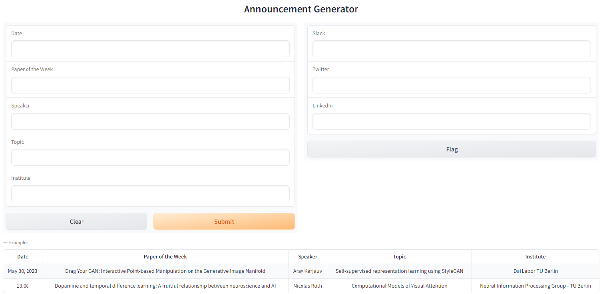

# BlissKomm 🌟📢

BlissKomm is an exhilarating Python tool that brings the power of GPT-3 to your fingertips, allowing you to effortlessly craft captivating announcements. 🚀✨

## Installation

To get started with BlissKomm, simply follow these steps:

1. Clone the repository to your local machine.
2. Navigate to the project directory.
3. Install the required dependencies by running the following command:

   ```
   pip install -r requirements.txt
   ```

## Usage

Using BlissKomm is as easy as pie! 🍰🖋️

1. Open your terminal and navigate to the project directory.
2. Add your OpenAI API key to a file called `openai_key.txt`. Make sure to obtain an API key from OpenAI beforehand.
3. Run the following command to start BlissKomm:

   ```
   python src/announcements.py
   ```

4. Sit back and let the magic unfold! ✨🎩

## App

Check out this exciting screenshot to get a glimpse of BlissKomm's user-friendly interface and features! 📸👀



Feel free to explore the possibilities and let your creativity soar with BlissKomm. The world is your stage! 🌎🎭

🌟 Happy announcing with BlissKomm! 🌟💬